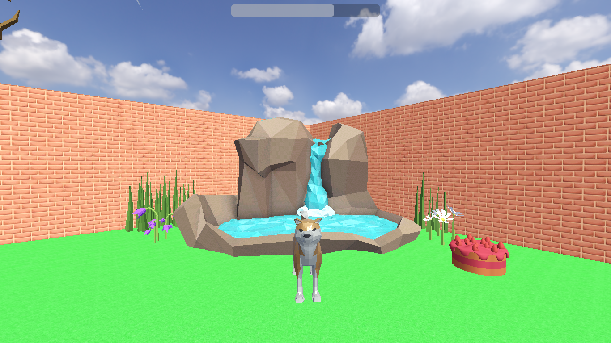
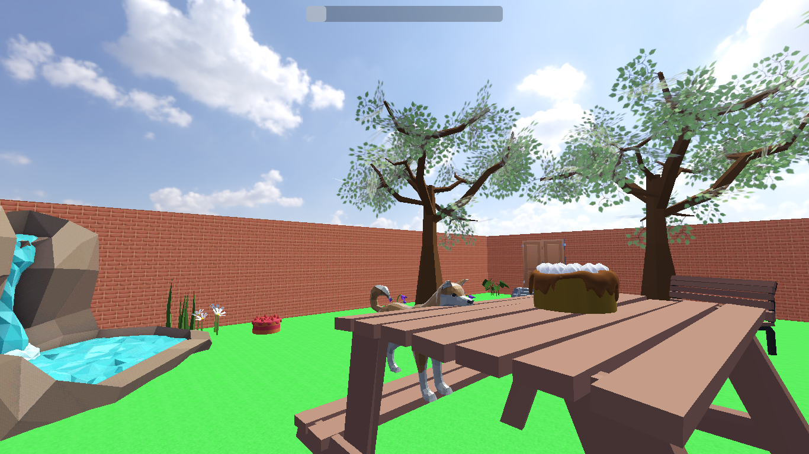
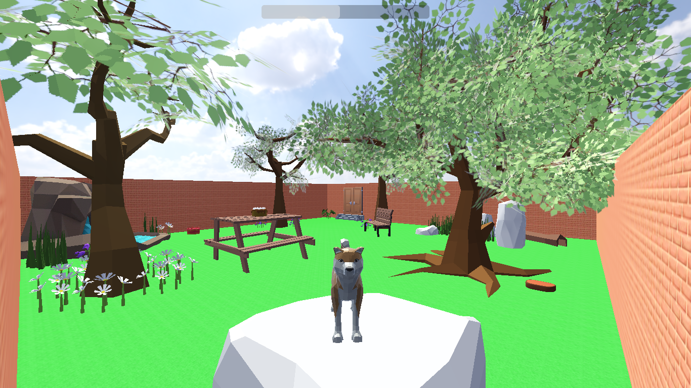

# 🐶 Day at the Dog Park

**Demo видео:** [Vimeo линк](https://vimeo.com/1058475444/24023b8b21?share=copy)

## 📖 Опис на играта

**Day at the Dog Park** е едноставна и забавна 3D авантура изработена во **Godot Engine**, во која играчот управува со куче што се движи низ парк во потрага по вкусни колачи. Целта е да се соберат **4 колачи** распоредени низ паркот во **рок од 60 секунди**. Играта комбинира флуидно движење, анимации, звучни ефекти и динамична околина, создавајќи релаксирачко, но предизвикувачко искуство за играчот.

## 🔑 Клучни функционалности

### 1. 🐾 Контрола и движење на кучето

Играчот управува со кучето од **перспектива на трето лице (3rd person)**, користејќи ги тастатурата и глувчето. Камерата е поставена зад кучето и овозможува флексибилна ротација, што му овозможува на играчот подобро да ја истражува околината.

- **Основни контроли**:

  - **Движење:** `W`, `A`, `S`, `D` или стрелки.
  - **Скок:** `Space`.
  - **Трчање:** `Shift` или алтернативно `Ctrl`.
  - **Рестарт на игра:** `R` во било кое време.

- **Состојби на движење:**

  - **Idle** – стоење во место.
  - **Walk** – нормално одење.
  - **Sprint** – забрзано трчање.

- **Анимации:** Секое од овие движења има своја посебна анимација, синхронизирана со брзината на кучето.
- **FOV (Field of View) ефект:** При трчање, **FOV се зголемува**, создавајќи чувство на брзина и динамика.

---

### 2. 🎥 Камера

Камерата е поставена во **3rd person** перспектива и е дизајнирана за **флуидна ротација со глувче**. Ова му дава на играчот контрола врз аголот и видливоста, што е особено важно при барање на колачите низ паркот.

---

### 3. 🔊 Звучни ефекти и аудио систем

Играта користи разновидни звучни ефекти за да го збогати искуството:

- **Движење:** Звуци за чекори при одење и трчање, кои соодветствуваат со темпото на кучето.
- **Случајно дишење (panting):**
  - Случајно дишење во одредени интервали.
  - 50% шанса да почне да дише откако ќе заврши со трчање.
- **Блискост до фонтана:** Гласноста на звукот од фонтаната се зголемува што повеќе се приближува играчот.
- **Амбиент:** Тивки шумски звуци кои создаваат реалистична паркова атмосфера.
- **Лаење:** Играчот може да активира звук на лаење за дополнителна интеракција.

---

### 4. 🍰 Собирање на предмети (Колачи и месо)

На мапата се распоредени **различни видови конзумирачки предмети** како колачи, торти и месо. Целта на играчот е да собере **вкупно 4 предмети** за да победи.

- Предметите се **распоредени на различни локации** – некои се на видливи места, додека други бараат да се истражи околината.
- **Загатка со камења:** Поставена е мала логичка пречка со карпи што формираат скали, кои водат до последната пита. Играчот мора да ги пронајде и да ги искачи скалите за да ја заврши играта.
  с

---

### 5. ⏳ Тајмер

Играта е временски ограничена – играчот има **60 секунди** да ги собере сите 4 предмети. Одбројувањето е видливо на екранот и создава тензија кај играчот.

- Ако времето истече пред да ги собере сите предмети – **играчот губи**.
- Ако ги собере сите предмети во рамки на времето – **играчот победува**.

---

### 6. 🏆 Завршен екран

По завршувањето на играта, се прикажува соодветна порака:

- **„Победивте!“** – ако се собрани сите предмети.
- **„Обиди се повторно!“** – ако времето истече.

Секогаш постои опција **да се рестартира играта со копче `R`**, без разлика дали играта е завршена или сè уште трае.

## 🌿 Околина и визуелни карактеристики

Мапата е **мал парк со различни објекти** кои ја збогатуваат атмосферата:

- **Дрвја, цвеќиња, клупи, пикник маси.**
- **Фонтана со звук** кој станува погласен што повеќе се приближувате.
- **Камења кои формираат скали** – мала загатка за пристап до последното колаче.
- **Ограда и влезна капија** што создаваат впечаток на приватен парк за кучиња.
- **Подлогата и ѕидовите** користат seamless текстури, што создава природен и естетски изглед.
- **Динамично небо:** Со **анимирани облаци** што ротираат, додавајќи чувство на живост и пространост.

## 🛠 Управување со системи

### 1. 🕹 GameManager

- Управува со **статусот на играта**, следење на тајмерот и проверка на условите за победа или пораз.

### 2. 🔊 AudioManager

- Контролира **амбиентални звуци** од паркот, **звукот на фонтаната** и **ефектите од кучето** (чекори, дишење, лаење).

### 3. 🐶 Player Script

- Управува со **внесовите од тастатурата и глувчето**.
- Анимациски систем поврзан со состојбите на кучето.
- Комуницира со **контролерот за движење и камерата**.

### 4. 🍰 ConsumablesManager

- Следи и управува со **конзумирачките предмети**.
- Детектира **судири** меѓу кучето и предметите.
- Генерира сигнал при собирање на предмет.

## 🧑‍💻 Сигнали и поврзаност

Системите комуницираат преку **Godot сигнали**, што овозможува модуларност и лесна проширливост:

- **Сигнал за собран предмет** → GameManager.
- **Сигнал за истечено време** → GameManager.
- **Сигнал за завршување на игра** → UI екран.

## 📸 Слики од играта

